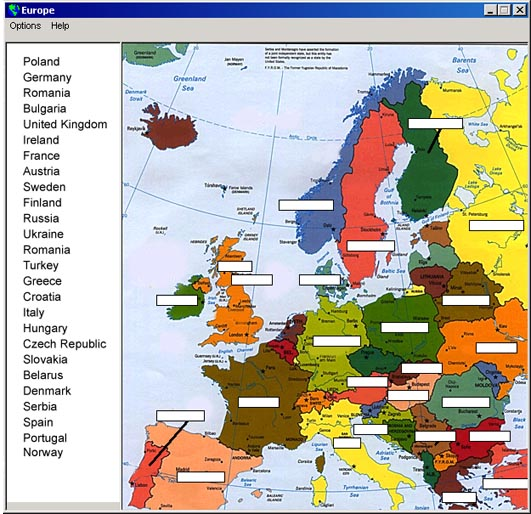



## Europe Map Test

### Description

This code is a application I did for extra credit in History. Its pretty cool code. There is a map of europe and you must enter each country name. There is no buttons, so once the country name is correct it will be greyed out. It is also removed from the country list. There is alos other features such as password protected help. Check out the screen shot and leave comments or votes. Thanks in advance. Jason / VBGUY
 
### More Info
 

             |
---                |---
**Submitted On**   |2001-03-03 03:18:48
**By**             |[VBguy](https://github.com/Planet-Source-Code/PSCIndex/blob/master/ByAuthor/vbguy.md)
**Level**          |Intermediate
**User Rating**    |3.5 (14 globes from 4 users)
**Compatibility**  |VB 5\.0, VB 6\.0
**Category**       |[Complete Applications](https://github.com/Planet-Source-Code/PSCIndex/blob/master/ByCategory/complete-applications__1-27.md)
**World**          |[Visual Basic](https://github.com/Planet-Source-Code/PSCIndex/blob/master/ByWorld/visual-basic.md)
**Archive File**   |[CODE\_UPLOAD15755332001\.zip](https://github.com/Planet-Source-Code/vbguy-europe-map-test__1-21487/archive/master.zip)

